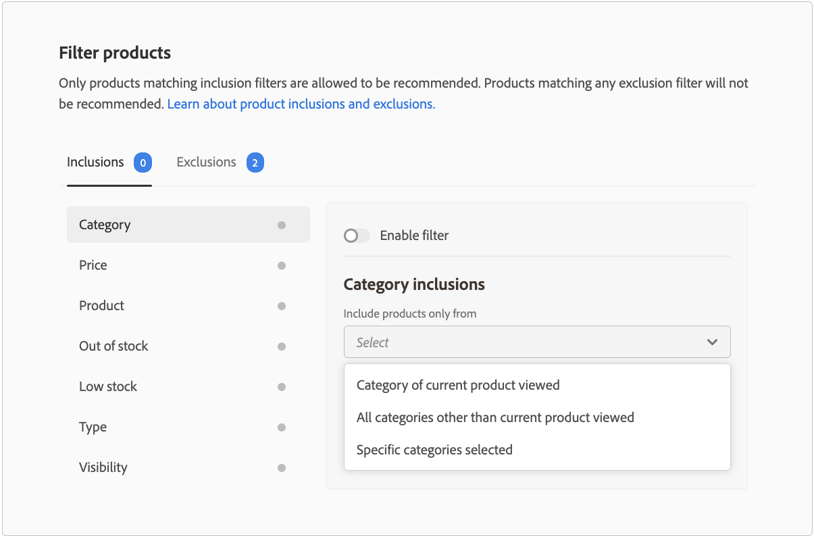

# Filtrar productos

Adobe Commerce aplica automáticamente filtros predeterminados no configurables a las unidades de recomendación. Si tiene varias unidades de recomendación implementadas en una página, Adobe Commerce filtra los productos que se repiten en las unidades. Solo se usa la primera referencia a un producto repetido, para dejar espacio a otros productos que se recomienden. Adobe Commerce también filtra todos los productos comprados anteriormente y los que están en el carro de compras.

Cuando [crea](create.md) una unidad de recomendación, puede definir filtros que controlen qué productos se pueden mostrar en las recomendaciones. Estos filtros se basan en un conjunto de condiciones de inclusión o exclusión que usted defina. En las recomendaciones solo aparecen los productos que cumplen todas las condiciones de inclusión. No se recomiendan los productos que coinciden con cualquiera de las condiciones de exclusión.

Puede configurar varios filtros y habilitar solo los que desee seleccionando la opción en cada página de filtro. Esto le permite crear borradores de filtros para su uso futuro. El número de filtros habilitados se muestra en cada pestaña.

## Condiciones

Las condiciones pueden ser estáticas o dinámicas.

- Una condición estática utiliza atributos de producto existentes para determinar qué productos pueden aparecer en la unidad. Por ejemplo, puede especificar que solo aparezcan en la unidad los productos en existencias con un precio mayor que 25 $. Las condiciones estáticas están disponibles en todos los tipos de página.

- Una condición dinámica elimina el contexto actual de un comprador, como la categoría o el producto que se está viendo en ese momento. Por ejemplo, al crear una recomendación de producto para implementarla en páginas de detalles de producto, puede crear una condición para recomendar solo productos que se encuentren dentro de un rango de precios relativo del producto que se está viendo en ese momento. Las condiciones dinámicas están disponibles en todos los tipos de página, excepto en la página de inicio y en páginas con recomendaciones colocadas con Page Builder.

### Operadores lógicos

Los operadores lógicos `AND` y `OR` se utilizan para unir varias condiciones. Si utiliza filtros de inclusión y exclusión, las inclusiones se evalúan primero para determinar todos los productos posibles que se pueden recomendar y, a continuación, se eliminan de la lista los productos que coinciden con cualquier filtro de exclusión.

- `AND` - Une dos condiciones de filtrado de inclusión
- `OR` - Une dos condiciones de filtrado de exclusión

>[!NOTE]
>
> Los filtros de inclusión y exclusión reemplazan a las exclusiones de categoría heredadas en las versiones 3.2.2 y posteriores del módulo `magento/product-recommendations`. Consulte las [notas de la versión](release-notes.md) para obtener más información acerca de las versiones de Adobe Commerce.

## Tipos de filtros {#filtertypes}

### Categoría

Filtra los productos según su categoría. El filtro de categoría utiliza asignaciones de categoría directa y sus subcategorías. Por ejemplo, al habilitar una condición de exclusión para la categoría `Gear` se excluyen los productos asignados a `Gear` y todas sus subcategorías, como `Gear/Bags` o `Gear/Fitness Equipment`. Lo mismo se aplica a un filtro de inclusión en una categoría. Por ejemplo, al habilitar una condición de inclusión para la categoría `Gear` se incluyen los productos asignados a `Gear` y todas sus subcategorías, como `Gear/Bags` o `Gear/Fitness Equipment`.

El campo de categoría muestra las categorías que pertenecen a la vista de tienda actual.

>[!NOTE]
>
>Para los comerciantes B2B, el filtro Categoría se adhiere a cualquier [categoría de producto específica del cliente](https://experienceleague.adobe.com/docs/commerce-admin/catalog/categories/category-permissions.html?lang=es) que haya configurado.

Adobe Commerce recomienda utilizar la siguiente configuración de filtro de categoría al implementar recomendaciones en los tipos de página:

| Página | Filtrar por |
|---|---|
| Inicio | No filtre los productos. |
| Categoría | Filtre los productos en la categoría específica. |
| Detalles del producto | Filtre los productos en las mismas categorías. |
| Carrito | Filtrar categorías de productos en el carro de compras. |
| Confirmación del pedido | Filtrar categorías de productos comprados. |

### Product

Los filtros de producto especifican qué productos específicos son aptos o no para mostrarse en las recomendaciones. No puede seleccionar productos que estén desactivados o no sean visibles individualmente porque dichos productos nunca pueden aparecer en las recomendaciones.

>[!NOTE]
>
>Los productos secundarios de un producto configurable no se muestran en una unidad de recomendación porque tienen la visibilidad de _No visible individualmente_.

### Tipo

Un filtro basado en un tipo de producto incluye o excluye todos los productos de un tipo específico. Los tipos admitidos son _simple_, _configurable_, _virtual_, _descargable_ o _tarjeta regalo_. No se admiten los tipos de producto _Paquete_, _agrupado_ y personalizado.

### Visibilidad

Filtra productos basados en visibilidad, como: _Catálogo_, _Búsqueda_ o ambos.

### Precio

Un filtro basado en el precio del producto utiliza el precio final para realizar la comparación. El precio final incluye cualquier descuento o precio especial disponible para compradores anónimos. Para los comerciantes B2B, el precio mostrado refleja los [precios de grupo específicos del cliente](https://experienceleague.adobe.com/docs/commerce-admin/catalog/products/pricing/pricing-advanced.html?lang=es) que ha configurado.

### Estado de stock

Los siguientes filtros de exclusión se pueden utilizar para filtrar los productos en función del estado de stock:

- Agotado: (solo exclusión) Excluye los productos sin existencias.
- Bajo en stock: (solo exclusión) Excluye los productos que están bajo en stock. El estado de existencias bajo se basa en el valor _Solo X del umbral izquierdo_ en la [configuración del inventario](https://experienceleague.adobe.com/docs/commerce-admin/config/catalog/inventory.html?lang=es).
