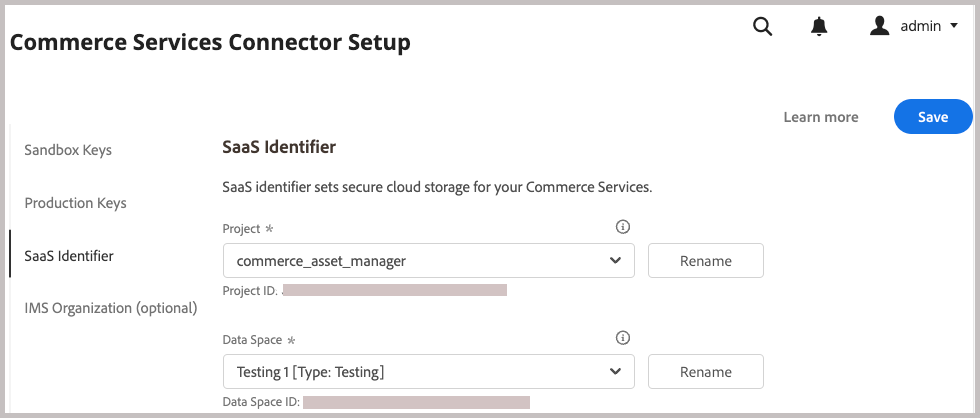
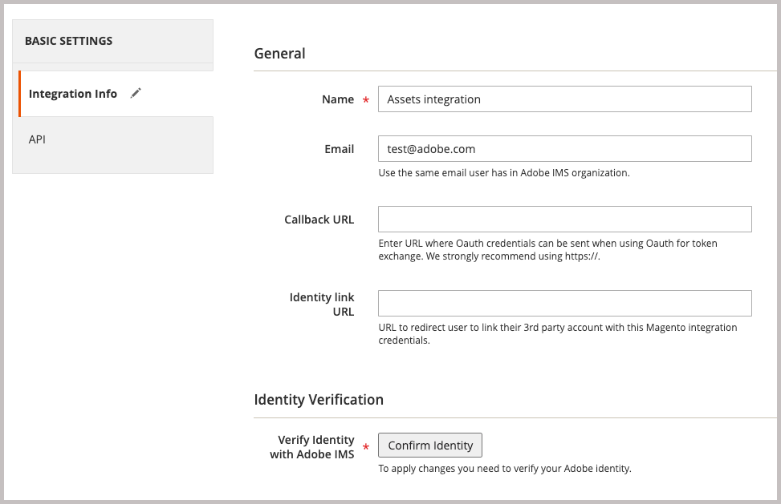

# Instalación de paquetes de Adobe Commerce

Esta integración para Commerce permite la sincronización de recursos entre Adobe Commerce y Adobe Experience Manager Assets (AEM Assets). La extensión proporciona un conjunto de herramientas y servicios para administrar la imagen del producto, el vídeo y otros recursos de medios en ambas plataformas.

Agregue esta extensión al entorno de Commerce instalando la extensión PHP `aem-assets-integration`. También debe habilitar Adobe I/O Events para Commerce y generar las credenciales necesarias para la comunicación y los flujos de trabajo entre Adobe Commerce y Adobe Experience Manager Assets.

**Requisitos de acceso**

Necesita las siguientes funciones y permisos para habilitar la integración de Commerce con los AEM Assets.

- [Administrador de proyectos en la nube de Commerce](https://experienceleague.adobe.com/es/docs/commerce-cloud-service/user-guide/project/user-access): instale las extensiones necesarias y configure el servidor de aplicaciones de Commerce desde el administrador o la línea de comandos.

   - Acceda a [repo.magento.com](https://repo.magento.com/admin/dashboard) para instalar la extensión.

     Para obtener la generación de claves y los derechos necesarios, consulta [Obtener tus claves de autenticación](https://experienceleague.adobe.com/es/docs/commerce-operations/installation-guide/prerequisites/authentication-keys). Para instalaciones en la nube, consulte la [Guía de Commerce en infraestructura en la nube](https://experienceleague.adobe.com/es/docs/commerce-cloud-service/user-guide/develop/authentication-keys)

- [Administrador de Commerce](https://experienceleague.adobe.com/es/docs/commerce-admin/start/guide-overview): actualice la configuración de la tienda y administre las cuentas de usuario de Commerce.

>[!TIP]
>
> Adobe Commerce se puede configurar para usar [autenticación IMS de Adobe](https://experienceleague.adobe.com/es/docs/commerce-admin/start/admin/ims/adobe-ims-config).

## Flujo de trabajo de instalación y configuración

Instale el paquete de Adobe Commerce y prepare el entorno de Commerce realizando las siguientes tareas:

1. [Instale la integración de AEM Assets para la extensión de Commerce (`aem-assets-integration`)](#install-the-aem-assets-integration-extension).

1. [Configure Commerce Services Connector](#configure-the-commerce-services-connector) para conectar su instancia de Adobe Commerce y con los servicios que permiten la transmisión de datos entre Adobe Commerce y los AEM Assets.

1. [Configuración de Adobe I/O Events para Commerce](#configure-adobe-io-events-for-commerce)

1. [Obtener credenciales de autenticación para el acceso a API](#get-authentication-credentials-for-api-access)

## Instalar la extensión `aem-assets-integration`

Instale la última versión de la extensión de integración de AEM Assets (`aem-assets-integration`) para los elementos visuales del producto en una instancia de Adobe Commerce con versión de Adobe Commerce 2.4.5+. La extensión se entrega como un metapaquete de composición desde el repositorio [repo.magento.com](https://repo.magento.com/admin/dashboard).

>[!BEGINTABS]

>[!TAB Infraestructura en la nube]

Utilice este método para instalar la extensión [!DNL AEM Assets Integration] en una instancia de Commerce Cloud.

1. En la estación de trabajo local, cambie al directorio del proyecto para su proyecto de Adobe Commerce en la nube.

   >[!NOTE]
   >
   >Para obtener información sobre cómo administrar los entornos de proyecto de Commerce localmente, consulte [Administración de ramas con la CLI](https://experienceleague.adobe.com/es/docs/commerce-cloud-service/user-guide/develop/cli-branches) en la _Guía del usuario de Adobe Commerce on Cloud Infrastructure_.

1. Consulte la rama de entorno para actualizar con la CLI de Adobe Commerce Cloud.

   ```shell
   magento-cloud environment:checkout <environment-id>
   ```

1. Añada la extensión AEM Assets Integration para Commerce.

   ```shell
   composer require "magento/aem-assets-integration" "<version-tbd>" --no-update
   ```

1. Actualizar dependencias del paquete.

   ```shell
   composer update "magento/aem-assets-integration"
   ```

1. Confirme y envíe los cambios de código para los archivos `composer.json` y `composer.lock`.

1. Agregue, confirme e inserte los cambios de código para los archivos `composer.json` y `composer.lock` en el entorno de nube.

   ```shell
   git add -A
   git commit -m "Install AEM Assets Integration extension for Adobe Commerce"
   git push origin <branch-name>
   ```

   Al insertar las actualizaciones, se inicia el [proceso de implementación en la nube de Commerce](https://experienceleague.adobe.com/es/docs/commerce-cloud-service/user-guide/develop/deploy/process) para aplicar los cambios. Compruebe el estado de implementación desde el [registro de implementación](https://experienceleague.adobe.com/es/docs/commerce-cloud-service/user-guide/develop/test/log-locations#deploy-log).

>[!TAB Local]

Utilice este método para instalar la extensión [!DNL AEM Assets Integration] para una instancia local.

1. Use el Compositor para añadir la extensión Integración de AEM Assets para Commerce a su proyecto:

   ```shell
   composer require "magento/aem-assets-integration" --no-update
   ```

1. Actualice las dependencias e instale la extensión:

   ```shell
   composer update  "magento/aem-assets-integration"
   ```

1. Actualizar Adobe Commerce:

   ```shell
   bin/magento setup:upgrade
   ```

1. Borre la caché:

   ```shell
   bin/magento cache:clean
   ```

>[!TIP]
>
>Al implementar en producción, considere no borrar el código compilado para ahorrar tiempo. Realice siempre una copia de seguridad del sistema antes de realizar cambios.

>[!ENDTABS]

## Configuración de Commerce Services Connector

>[!NOTE]
>
>La configuración del Conector de servicios de Commerce es un proceso único necesario para usar [Servicios SaaS de Adobe Commerce](https://experienceleague.adobe.com/es/docs/commerce/user-guides/integration-services/saas#availableservices). Si ya ha configurado el conector para otro servicio, puede ver la configuración existente desde el administrador de Commerce seleccionando **[!UICONTROL Systems]** > [!UICONTROL Services] > **[!UICONTROL Commerce Services Connector]**.

Para transmitir datos entre su instancia de Adobe Commerce y los servicios que habilitan la integración de AEM Assets, configure Commerce Services Connector desde el administrador (**[!UICONTROL System]** > [!UICONTROL Services] > **[!UICONTROL Commerce Services Connector]**).

{width="600" zoomable="yes"}

Proporcione los siguientes valores en la configuración

- Claves de API de producción y zona protegida para la autenticación
- Nombre del espacio de datos (identificador SaaS) para el almacenamiento seguro en la nube
- ID de la organización IMS donde se aprovisionan los entornos Commerce y AEM Assets.

Para obtener instrucciones detalladas, vea el [vídeo de configuración del Conector de servicios de Commerce](https://experienceleague.adobe.com/es/docs/commerce-learn/tutorials/admin/adobe-commerce-services/configure-adobe-commerce-services-connector#configuration-faqs); consulte la [documentación del Conector de servicios de Commerce](../../landing/saas.md#organizationid).

Al guardar la configuración, el sistema genera los ID de proyecto SaaS y de base de datos para su entorno. Estos valores son necesarios para habilitar la sincronización de recursos entre Adobe Commerce y los AEM Assets.

## Configuración de Adobe I/O Events para Commerce

La integración de AEM Assets utiliza el servicio Adobe I/O Events para enviar datos de evento personalizados entre la instancia de Commerce y Experience Cloud. Los datos de evento se utilizan para coordinar los flujos de trabajo de la integración de AEM Assets.

Antes de configurar Adobe I/O Events, compruebe la configuración del trabajo de RabbitMQ y cron para su proyecto de Commerce:

- Asegúrese de que RabbitMQ esté habilitado y atento a los eventos.
   - [Configuración de RabbitMQ para Adobe Commerce local](https://experienceleague.adobe.com/es/docs/commerce-cloud-service/user-guide/configure/service/rabbitmq)
   - [Configuración de RabbitMQ para Adobe Commerce en la infraestructura en la nube](https://experienceleague.adobe.com/es/docs/commerce-cloud-service/user-guide/configure/service/rabbitmq)
   - Compruebe que [los trabajos cron están habilitados](https://developer.adobe.com/commerce/extensibility/events/configure-commerce/#check-cron-and-message-queue-configuration). Se requieren trabajos Cron para la comunicación y flujos de trabajo para la integración de AEM Assets.

>[!NOTE]
>
> Para los proyectos de la versión 2.4.5 de Commerce, debe [instalar los módulos de Adobe I/O](https://developer.adobe.com/commerce/extensibility/events/installation/#install-adobe-io-modules-on-commerce). En Commerce versión 2.4.6+, estos módulos se cargan automáticamente. Para la integración de AEM Assets para Commerce, solo necesita instalar los módulos. No se requiere la configuración de App Builder.


### Habilitar el marco de eventos de Commerce

Habilite el marco de eventos desde el administrador de Commerce.

>[!NOTE]
>
>La configuración de App Builder solo es necesaria si planea utilizar una estrategia de coincidencia personalizada para sincronizar recursos entre Commerce y los AEM Assets.

1. Desde el administrador, vaya a **[!UICONTROL Stores]** > [!UICONTROL Settings] > **[!UICONTROL Configuration]** > **[!UICONTROL Adobe Services]** > **Adobe I/O Events**.

1. Expandir **[!UICONTROL Commerce events]**.

1. Establezca **[!UICONTROL Enabled]** en `Yes`.

   {width="600" zoomable="yes"}

1. Escriba el nombre de la compañía comerciante en **[!UICONTROL Merchant ID]** y el nombre de entorno en los campos **[!UICONTROL Environment ID]**. Utilice únicamente caracteres alfanuméricos y guiones bajos al configurar estos valores.

>[!BEGINSHADEBOX]

**Configurar VCL personalizado para bloquear solicitudes**

Si utiliza un fragmento de VCL personalizado para bloquear solicitudes entrantes desconocidas, es posible que tenga que incluir el encabezado HTTP `X-Ims-Org-Idheader` para permitir conexiones entrantes desde el servicio AEM Assets Integration for Commerce.

>[!TIP]
>
> Puede utilizar el módulo Fastly de CDN para crear una ACL de Edge con una lista de direcciones IP que desee bloquear.

El siguiente código de fragmento de VCL personalizado (formato JSON) muestra un ejemplo con un encabezado de solicitud `X-Ims-Org-Id`.

```json
{
  "name": "blockbyuseragent",
  "dynamic": "0",
  "type": "recv",
  "priority": "5",
  "content": "if ( req.http.X-ims-org ~ \"<YOUR-IMS-ORG>\" ) {error 405 \"Not allowed\";}"
}
```

Antes de crear un fragmento basado en este ejemplo, revise los valores para determinar si necesita realizar algún cambio:

- `name`: nombre del fragmento de VCL. Este ejemplo usa el nombre `blockbyuseragent`.

- `dynamic`: establece la versión del fragmento. Este ejemplo utiliza `0`. Consulte los [fragmentos de VCL de Fastly](https://www.fastly.com/documentation/reference/api/vcl-services/snippet/) para obtener información detallada del modelo de datos.

- `type`: especifica el tipo de fragmento de VCL, que determina la ubicación del fragmento en el código de VCL generado. Este ejemplo utiliza `recv`. Consulte [Fastly VCL snippet reference](https://www.fastly.com/documentation/reference/api/#api-section-snippet) para obtener la lista de tipos de fragmentos.

- `priority`: Determina cuándo se ejecuta el fragmento de VCL. Este ejemplo utiliza la prioridad `5` para ejecutarse inmediatamente y comprobar si una solicitud de administrador proviene de una dirección IP permitida.

- `content`: fragmento de código VCL que se va a ejecutar, que comprueba la dirección IP del cliente. Si la IP está en la ACL de Edge, se bloquea el acceso con un error `405 Not allowed` para todo el sitio web. Todas las demás direcciones IP de cliente tienen acceso permitido.

Para obtener información detallada sobre el uso de fragmentos de VCL para bloquear solicitudes entrantes, consulte [VCL personalizado para bloquear solicitudes](https://experienceleague.adobe.com/es/docs/commerce-cloud-service/user-guide/cdn/custom-vcl-snippets/fastly-vcl-blocking) en la _Guía de infraestructura de Commerce en la nube_.

>[!ENDSHADEBOX]

## Obtener credenciales de autenticación para el acceso a API

La integración de AEM Assets para Commerce requiere credenciales de autenticación de OAuth para permitir el acceso de la API a la instancia de Commerce. Estas credenciales son necesarias para autenticar solicitudes de API al administrar recursos mediante la integración de AEM Assets.

Para generar las credenciales, agregue la integración a la instancia de Commerce y actívela.

### Añadir la integración al entorno de Commerce

1. Desde el administrador, ve a **Sistema** > Extensiones > **Integraciones** y luego haz clic en **Agregar nueva integración**.

1. Introduzca información sobre la integración.

   En la sección **General**, solo especifique la integración **Nombre** y **Correo electrónico**. Utilice el correo electrónico para una cuenta de Adobe IMS con acceso a la organización en la que se implementan Commerce y Experience Manager Assets.

   {width="600" zoomable="yes"}

1. Comprueba tu identidad haciendo clic en **Confirmar identidad**.

   El sistema comprueba su identidad autenticándose en Experience Cloud con su Adobe ID.

1. Configure los recursos de API.

   1. En el panel izquierdo, haga clic en **[!UICONTROL API]**.

   1. Seleccione el medio externo **[!UICONTROL Catalog > Inventory > Products > External Media]**.

      {width="600" zoomable="yes"}

1. Haga clic en **[!UICONTROL Save]**.

### Generar credenciales de OAuth

En la página Integraciones, genere las credenciales de autenticación de OAuth haciendo clic en **Activar** para la integración de Assets. Necesita estas credenciales para registrar el proyecto de Commerce con el servicio del motor de reglas de Assets y enviar solicitudes de API para administrar recursos entre Adobe Commerce y los AEM Assets.

1. En la página Integraciones, genere las credenciales haciendo clic en **[!UICONTROL Activate]**.

   {width="600" zoomable="yes"}

1. Si planea utilizar la API, guarde las credenciales de la clave del consumidor y el token de acceso para configurar la autenticación en el cliente de API.

   {width="600" zoomable="yes"}

1. Haga clic en **[!UICONTROL Done]**.

>[!NOTE]
>
>También puede generar credenciales de autenticación mediante las API de Adobe Commerce. Para obtener más información sobre este proceso y sobre la autenticación basada en OAuth para Adobe Commerce, consulte [Autenticación basada en OAuth](https://developer.adobe.com/commerce/webapi/get-started/authentication/gs-authentication-oauth/) en la documentación de Adobe Developer.

## Siguiente paso

- [Configuración de la integración desde Commerce Admin](setup-synchronization.md)
