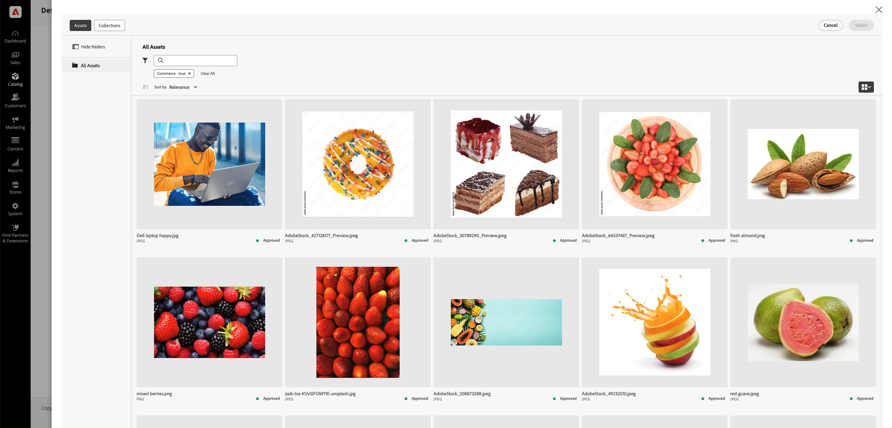

# Selección manual de recursos

El **Selector de recursos de AEM** permite a los especialistas en mercadotecnia y mercadotecnia agregar fácilmente imágenes de los AEM Assets a Adobe Commerce, lo que optimiza el proceso de administración de recursos. Este método garantiza la coherencia y el cumplimiento de la marca limitando la selección de recursos a los revisados y aprobados en [!DNL DAM (Digital Asset Management system)].

El **Selector de recursos de AEM** está disponible cuando el ID de cliente de IMS para el proyecto de AEM Assets se ha configurado en el administrador de Commerce. Consulte [Configuración del selector de recursos de AEM]&#x200B;(#configure-the-aem-asset-selector-in-adobe-commerce.

Una vez configurada la integración de **AEM Asset Selector**, los especialistas en marketing y los comerciantes podrán:

* Administre las imágenes de categoría sin esfuerzo, para que se ajusten a las directrices de marca y campaña.
* [!BADGE Solo PaaS]{type=Informative tooltip="Solo se aplica a proyectos de Adobe Commerce en la nube (infraestructura PaaS administrada por Adobe)."}: asigne recursos directamente en Page Builder para contenido visualmente enriquecido.

>[!NOTE]
>
> El Selector de recursos de AEM es un componente front-end de recursos de AEM para integrar AEM Assets con aplicaciones de creación. Para obtener más información sobre este componente, consulte el [Selector de recursos de Micro-Frontend](https://experienceleague.adobe.com/en/docs/experience-manager-cloud-service/content/assets/manage/asset-selector/overview-asset-selector){target=_blank} en la *Guía del usuario de AEM as a Cloud Service*.

## Ventajas principales

La incrustación del Selector de recursos de AEM en el Panel de administración de Adobe Commerce ofrece varias ventajas clave:

* **Coherencia de la marca**: muestra solo los recursos aprobados, lo que minimiza el riesgo de que haya imágenes obsoletas o no compatibles en la tienda.

* **Eficiencia**: permite a los especialistas en marketing y a los comerciantes asignar recursos rápidamente sin cambiar entre distintas plataformas.

* **Collaboration optimizado**: facilita el trabajo en equipo al permitir la selección directa de imágenes desde DAM, lo que elimina las descargas y cargas manuales.

* **Calidad de contenido mejorada**: garantiza el uso de imágenes optimizadas de alta resolución en páginas de productos, categorías y Page Builder.

{width="600" zoomable="yes"}

## Configuración del Selector de recursos de AEM en Adobe Commerce

1. En el Administrador de Commerce, vaya a **[!UICONTROL Store]** > Configuración > **[!UICONTROL ADOBE SERVICES]** > **[!UICONTROL AEM Assets Integration]**.

1. Rellene el campo **[!UICONTROL IMS Client ID]**.

1. **Guarde** la configuración.

## Pasos siguientes

* [Administrar imágenes de categoría con el selector de recursos](../manage-assets.md#category-images)
* [Administración de imágenes en el contenido de Page Builder](../manage-assets.md#using-aem-asset-selector-in-page-builder)
